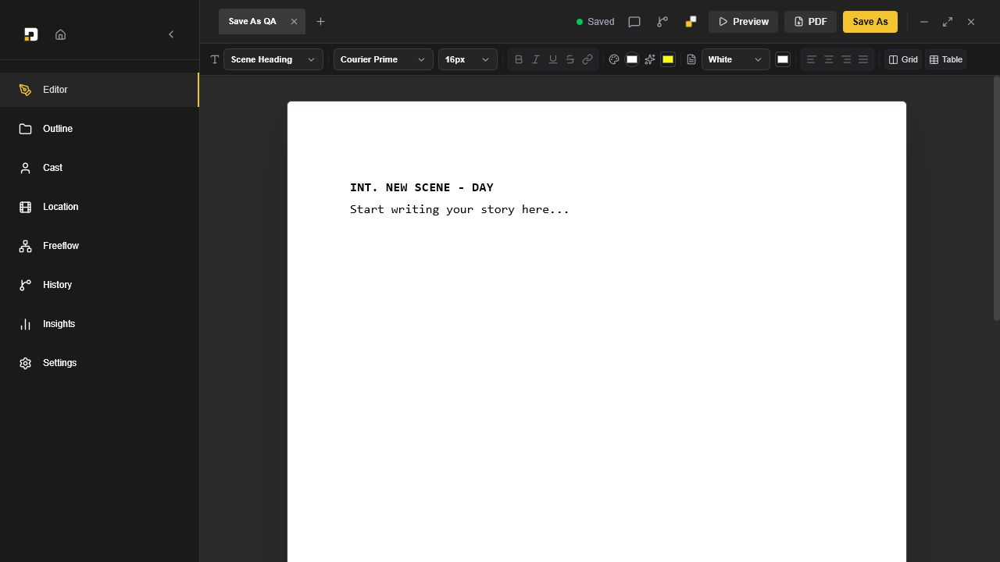
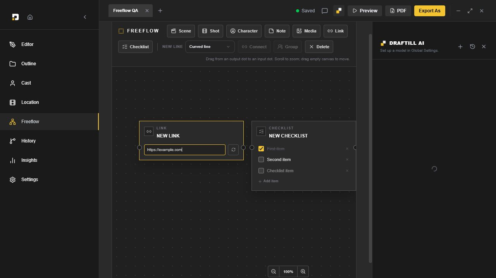

<p align="center">
  
</p>

<h1 align="center">Draftill</h1>

<p align="center">
  A Windows desktop workspace for screenplay writing, story planning, visual Freeflow boards, version checkpoints, and AI-assisted editing.
</p>

<p align="center">
  <strong>Version 0.4.15</strong> · Windows 10/11 x64 · Electron + React + TypeScript
</p>

## Download

Download the latest Windows installer from the repository's **Releases** page:

`Draftill-Windows-0.4.15-Setup.exe`

The installer is the recommended option for writers. The repository source is provided for transparency, security review, and reproducible unmodified builds.

## Editor



Draftill provides a focused screenplay editor with screenplay element formatting, typography controls, tables, grids, PDF export, comments, and local screenplay checkpoints.

## Freeflow



Freeflow supports draggable story nodes, connectors, groups, notes, media, link previews, checklists, and selected-node context for Draftill AI.

## Highlights

- Screenplay-focused editor with reusable story templates.
- PDF export that preserves screenplay tables, grids, and columns.
- Character and location libraries with images and screenplay references.
- Freeflow node canvas with connectors, groups, links, and checklists.
- Screenplay-only local version checkpoints and rollback.
- Comments, outline navigation, project statistics, and keyboard shortcuts.
- Optional AI assistance for editor, character, location, comments, and Freeflow actions.
- Local vision-model support through bundled `llama.cpp` runtime files.
- Encrypted API-key storage through Electron safe storage.

## Build from source

### Requirements

- Windows 10 or Windows 11, x64.
- Node.js 20 or newer.
- npm 10 or newer.

### Development

```powershell
npm install
npm run dev
```

### Validate and build

```powershell
npm run typecheck
npm run build
```

### Build the Windows installer

```powershell
npm run package:win
```

The installer is written to `release/<version>/`.

## AI models and API keys

Draftill does not include downloaded AI model weights in this repository. Local model files are downloaded by the user and stored under Draftill's application-data directory. Provider API keys are entered locally and encrypted using Electron's operating-system-backed safe storage.

## License

Draftill is **source-available**, not open source under the Open Source Initiative definition.

You may use the unmodified application in personal and commercial workflows. You may view and audit the source and compile an unmodified private copy. You may not modify, create derivative works, rebrand, resell, redistribute, sublicense, or offer Draftill as a hosted service without separate written permission.

Read [LICENSE](LICENSE) and [LICENSE_SUMMARY.md](LICENSE_SUMMARY.md) before using the source. Third-party components remain under their respective licenses; see [THIRD_PARTY_NOTICES.md](THIRD_PARTY_NOTICES.md).

## Reporting issues

Bug reports and feature requests are welcome through GitHub Issues. Please do not submit source-code modifications unless the maintainers explicitly invite them under a separate written contribution agreement.

## Disclaimer

Draftill is provided without warranty. Always keep backups of important screenplay projects.
